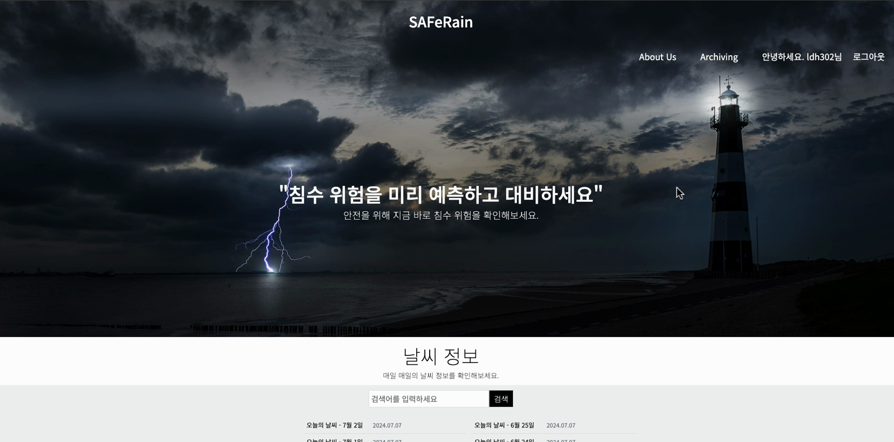
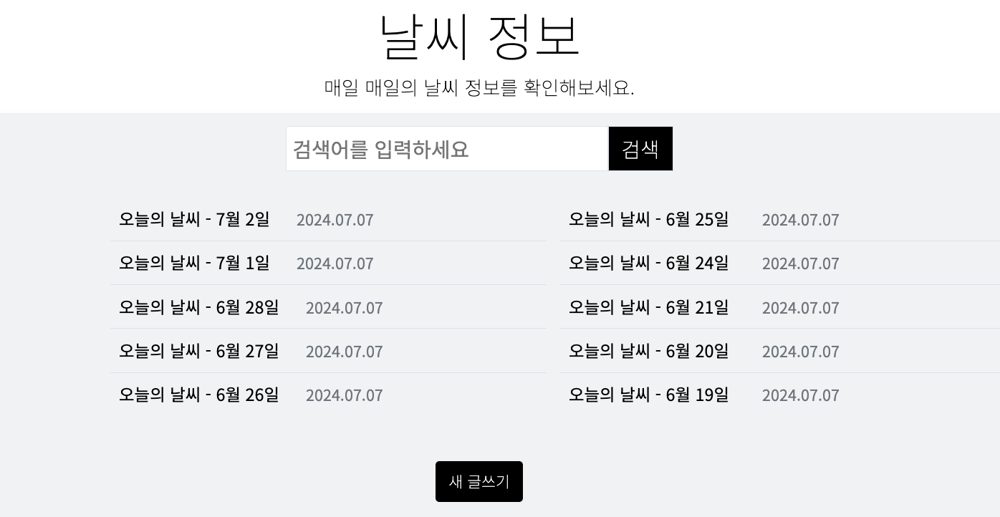
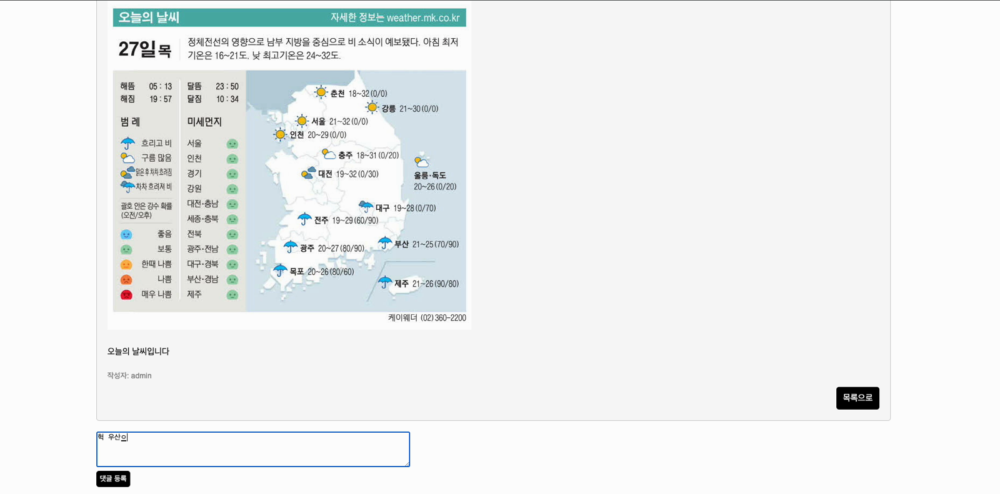
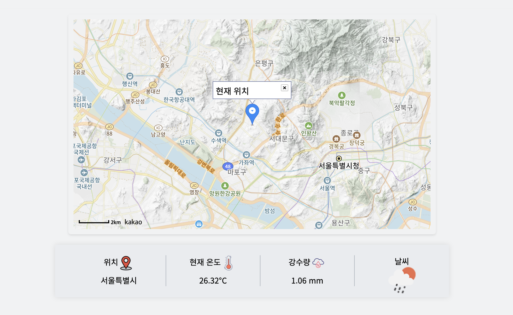
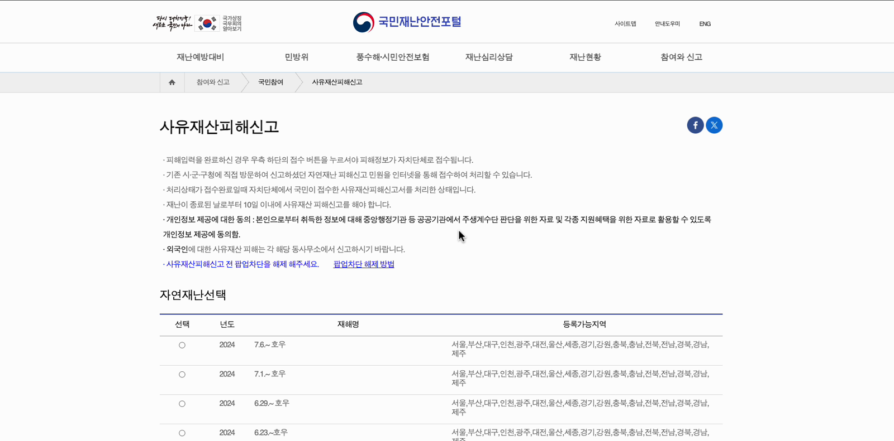

# — 호우·침수 피해 예방 Web 서비스

사용자의 현재 위치와 기상 정보를 한 화면에서 확인하고, 호우·침수 피해에 대비할 수 있는 정보를 제공하는 개인 프로젝트입니다.

## 프로젝트 소개

### 필요성

집중호우로 인한 침수 피해가 증가함에 따라, 사용자가 현재 위치의 날씨와 강수 정보를 쉽게 확인하고 사전에 대비할 수 있는 서비스가 필요하다고 생각했습니다.

### 목표

사용자의 현재 위치를 지도에 표시하고 해당 지역의 기온, 강수량, 날씨 상태를 함께 제공하는 것을 목표로 했습니다. 또한 날짜별 날씨 정보를 기록·검색할 수 있는 게시판과 침수 예방·피해 신고 관련 사이트를 연결하여 필요한 정보를 한곳에서 확인할 수 있도록 구성했습니다.

## 개발 정보

| 구분 | 내용 |
| --- | --- |
| 개발 기간 | 2024.07 |
| 개발 인원 | 1명(개인 개발) |
| 담당 범위 | 기획, 화면 구성, 프론트엔드·백엔드 구현, 외부 API 연동, 데이터베이스 연동, 기능 테스트 |

## 기술 환경

- Backend: Java, Spring MVC
- Frontend: JSP, JavaScript, HTML, CSS
- Database: MySQL
- API: 한국 기상청 API, Geolocation API, Kakao Maps API, Daum 우편번호 API

## 주요 기능

### 회원가입 및 로그인

- 사용자 정보 입력과 주소 검색을 포함한 회원가입 기능
- 등록한 계정을 이용한 로그인·로그아웃 기능
- 로그인한 사용자 정보를 기준으로 서비스 이용 상태 유지

### 현재 위치 및 기상 정보 확인

- Geolocation API를 이용한 현재 위치 확인
- Kakao Maps API를 이용한 지도와 현재 위치 마커 표시
- 현재 위치를 기준으로 기온, 강수량, 날씨 상태 표시

### 날씨 정보 게시판

- 관리자가 날짜별 날씨 정보를 등록할 수 있는 게시판 구현
- 게시글 목록 조회와 검색 기능
- 게시글 상세 조회와 댓글 등록 기능
- 게시글과 댓글 데이터를 MySQL에 저장·조회

### 침수 예방 및 피해 신고 정보

- 집중호우 발생 시 행동 요령과 침수 예방 관련 정보 제공
- 자연재난 피해 신고 등 관련 기관 페이지로 이동할 수 있는 링크 구성

## 처리 흐름

### 현재 위치·날씨 조회

1. 사용자에게 위치 정보 사용 동의를 요청합니다.
2. Geolocation API를 통해 현재 위치를 확인합니다.
3. Kakao Maps API를 이용해 지도에 현재 위치를 표시합니다.
4. 위치를 기준으로 기상 데이터를 요청합니다.
5. 기온, 강수량 및 날씨 상태를 화면에 표시합니다.

### 날씨 게시판

1. 사용자가 게시판 목록 조회 또는 검색을 요청합니다.
2. Spring MVC에서 요청 조건을 처리합니다.
3. MySQL에서 조건에 맞는 게시글을 조회합니다.
4. 조회 결과를 목록과 상세 화면에 표시합니다.
5. 작성한 댓글을 게시글과 연결하여 저장합니다.

## 실행 화면

### 메인 화면

침수 위험에 대한 안내와 날짜별 날씨 정보로 이동할 수 있는 메인 화면입니다.

### 날씨 정보 목록 및 검색

관리자가 등록한 날짜별 날씨 정보를 목록으로 확인하고 검색할 수 있습니다.

### 날씨 정보 상세 조회 및 댓글

게시글의 상세 날씨 정보를 확인하고 댓글을 등록할 수 있습니다.

### 현재 위치 및 기상 정보

사용자의 현재 위치를 지도에 표시하고, 해당 위치의 기온·강수량·날씨 상태를 함께 제공합니다.

### 자연재난 피해 신고 페이지 연결

서비스의 피해 신고 안내 링크를 통해 관련 공공기관 페이지로 이동할 수 있도록 구성했습니다. 위 화면은 외부 사이트이며, 해당 사이트 자체를 개발한 것은 아닙니다.

## 프로젝트를 통해 경험한 내용

개인 프로젝트로 주제 선정부터 화면 구성, Spring MVC 기반의 서버 기능 구현, MySQL 데이터 처리와 외부 API 연동까지 전체 개발 과정을 경험했습니다. 특히 브라우저에서 얻은 위치 정보를 지도와 기상 데이터에 연결하고, 외부 API의 응답 결과를 실제 화면에 표시하는 흐름을 이해할 수 있었습니다.

## 향후 개선 사항

- 지역별 침수 위험 수준 표시
- 강수량 기준 위험 알림 기능
- 모바일 화면 대응
- 기상 정보 자동 수집 및 게시 기능
